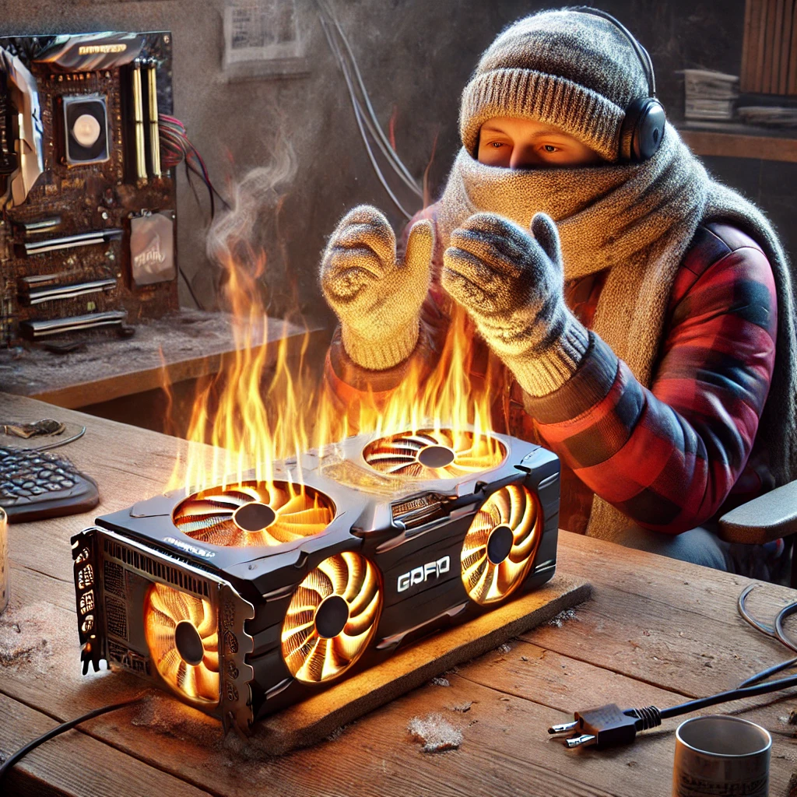
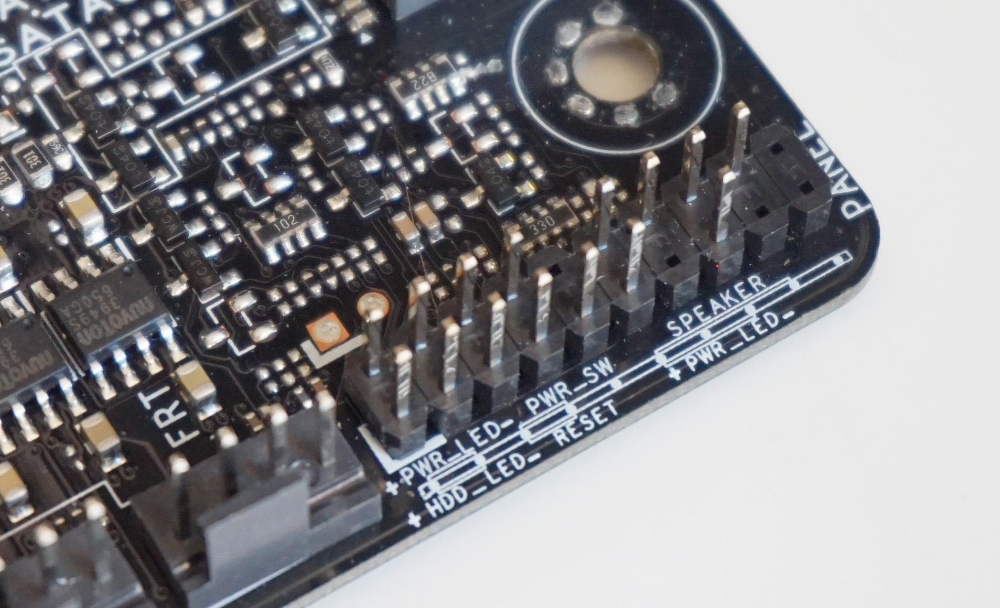

# 🧪 Lab: Building a Computer

## A Step-by-Step Guide: Building a Computer from Scratch 💻🛠️

## Introduction: Why Engineers Should Learn to Build Computers? 🤔

As an engineer, understanding how computers work at a fundamental level is critical. Computers are integral tools for designing, simulating, and testing solutions across various fields of engineering. Learning how to build one offers the following benefits:

- **Practical Knowledge**: Familiarity with hardware components improves problem-solving skills when systems fail.
- **Customization**: Tailor systems to specific tasks such as CAD, simulations, or software development.
- **Cost Efficiency**: Save money by assembling computers with optimized configurations.
- **Troubleshooting**: Diagnose and repair hardware issues with confidence.

## Instructions: Building a Computer from Scratch 🛠️

Building a computer is a valuable skill for engineers, providing insight into the integration of hardware components and their operation as a cohesive system. This process involves selecting compatible components, assembling them, and testing the system to ensure it functions as expected.

In this lab, you will focus on **rebuilding old computers** in small groups to understand hardware fundamentals and problem-solving techniques. This exercise mirrors the essential steps of building a computer from scratch while offering a practical introduction to key concepts. If you were to build a modern computer from scratch, here’s how the process would unfold:

## Selecting Components: Choosing the Right Parts 🧩

The most critical step in building a computer is choosing components that meet your needs while ensuring compatibility. Here's what you need to consider:

- **Processor (CPU)**: The brain of the computer. Select a CPU based on performance needs (e.g., Intel Core or AMD Ryzen series).

  - **Compatibility Tip**: Ensure the motherboard has the correct socket type (e.g., LGA 1700 for Intel or AM5 for AMD).

- **Motherboard**: Acts as the backbone, connecting all components.

  - **Key Features**:
    - Socket compatibility with the CPU.
    - Sufficient RAM slots and support for desired memory speed.
    - PCIe slots for GPU or other expansion cards.
    - Built-in I/O ports (USB, Ethernet, HDMI).

- **Memory (RAM)**: Temporary storage for active processes.

  - **Recommendation**: DDR4 or DDR5 with a minimum capacity of 16GB.
  - Ensure the RAM is compatible with the motherboard's supported speed.

- **Storage**: Choose a balance of speed and capacity:

  - **NVMe SSD**: For fast performance (e.g., boot times, application loads).
  - **SSD**: A good balance of speed and capacity for general use.
  - **HDD**: For additional storage of large files.

- **Graphics Card (GPU)**: Essential for graphical tasks like rendering, gaming, or CAD software. Also useful for machine learning or AI applications.

  - If the CPU has **integrated graphics**, you may not need a separate GPU for basic tasks.

- **Power Supply Unit (PSU)**: Provides electricity to all components.

  - **Tip**: Calculate the system's power consumption and choose a PSU with at least 30% extra wattage for a safety factor.

- **Case**: Protects and houses components. Look for proper size (ATX, Micro-ATX) and good airflow.

### Resource for Compatibility 🖥️

- **[PCPartPicker](https://pcpartpicker.com/)**: This online tool simplifies the process of selecting and verifying compatible components. It flags potential issues, such as mismatched sockets or insufficient PSU wattage.

## In-Lab Task: Rebuilding Old Computers

In this lab exercise, you will:

- Work in small groups to **reassemble and disassemble old computers**.
- Identify and categorize components (CPU, RAM, storage, GPU, etc.).
- Test rebuilt systems to ensure functionality.
- Apply critical thinking to troubleshoot any errors or misconfigurations.

## Mise en Place: Gather Your Tools 🧰

```{warning}
Electrical components are sensitive to static electricity. Before handling any parts, make sure to ground yourself by touching a metal object or wearing an anti-static wrist strap.
```

```{warning}
Ensure the power supply is unplugged and the power switch is off before starting the build process. Make sure that the system has been discharged of any residual power by pressing the power button after unplugging the power supply, and waiting at least 15 seconds before starting the build. Some capacitors can hold a charge even after the power supply is unplugged.
```

```{warning}
It is advisable to wear gloves when building computers this will prevent oils from your skin from getting on the components, and will protect you from chemical exposures such as thermal paste.
```

```{warning}
When handling the CPU, avoid touching the pins or the contact points on the bottom of the CPU. Hold the CPU by the edges to prevent damage.
```

Before you start building your computer you should ensure that you have all the necessary tools and components.

### Tools Required:

- **Screwdriver**: For securing components to the case.
- **Anti-Static Wrist Strap**: To prevent static discharge. Not needed here -- these parts were destined for e-waste.
- **Thermal Paste**: For CPU cooling (We are not going to apply thermal paste).
- **Cable Ties**: For cable management (we are not going to do cable management). However, people love to see a clean build.

```{image} ./assets/figures/cable-management-fail.jpg
:alt: cable management
:class: mb-1
:height: 400px
:align: center
```

### Components Required:

#### Case:

The enclosure that houses all components.

```{image} ./assets/figures/case.jpeg
:alt: case
:class: mb-1
:height: 400px
:align: center
```

#### Motherboard:

The main circuit board that connects all components. Your motherboard will already be installed in the case.

```{image} ./assets/figures/motherboard.png
:alt: motherboard
:class: mb-1
:height: 400px
:align: center
```

#### CPU:

This is the brain of the computer.

```{image} ./assets/figures/CPU.png
:alt: motherboard
:class: mb-1
:height: 400px
:align: center
```

#### CPU Cooler:

To keep the CPU cool during operation.

```{image} ./assets/figures/CPU-cooler.png
:alt: motherboard
:class: mb-1
:height: 400px
:align: center
```

#### RAM:

Random Access Memory for temporary storage.

```{image} ./assets/figures/ram.png
:alt: ram
:class: mb-1
:height: 400px
:align: center
```

#### Storage:

Non-volatile memory for storing data, and the operating system and preserving it when the power is off.

**NVMe SSD**

Non-Volatile Memory Express (NVMe) is a protocol for accessing high-speed storage media. NVMe can reach speeds up to 32 Gb/s, significantly faster than SATA SSDs.

```{image} ./assets/figures/NVME.jpg
:alt: nvme ssd
:class: mb-1
:height: 400px
:align: center
```

**SSD**

Solid State Drive (SSD) is a storage device that uses flash memory to store data. SSDs are faster and more reliable than traditional hard drives, and can achieve speeds up to 6 Gb/s.

```{image} ./assets/figures/SSD_image.JPG
:alt: ssd
:class: mb-1
:height: 400px
:align: center
```

**HDD**

Hard Disk Drive (HDD) is a traditional storage device that uses spinning disks to store data. HDDs are slower than SSDs but offer more storage capacity. They have speeds up to 1.2 Gb/s.

```{image} ./assets/figures/HDD-real.png
:alt: hdd
:class: mb-1
:height: 400px
:align: center
```

#### **GPU**:

Graphics Processing Unit for rendering graphics. Note that some CPUs have integrated graphics with output on the motherboard.

```{image} ./assets/figures/GPU.png
:alt: gpu
:class: mb-1
:height: 400px
:align: center
```

#### Power Supply Unit (PSU):

Supplies power to all components.

```{image} ./assets/figures/PSU.png
:alt: psu
:class: mb-1
:height: 400px
:align: center
```

#### Case Fans:

For cooling the system. Your case will come with fans pre-installed, however, the power might not be connected.

#### USB Drive:

Preloaded with the operating system for installation. We are going to install an open source Linux operating system called Ubuntu.

## Assemble the Computer ⚙️

### Step 1: Install the CPU 🧠

**1. Locate the CPU socket on the motherboard. This will be a square or rectangular slot with pins in the center of the motherboard. Usually, there is some sort of latch that you will need to release to open the socket.**

```{image} ./assets/figures/install-cpu-1.JPG
:alt: locating the CPU socket
:class: mb-1
:height: 400px
:align: center
```

**2. Release the latch and lift the CPU socket cover.**

```{image} ./assets/figures/install-cpu-2.JPG
:alt: releasing the latch
:class: mb-1
:height: 400px
:align: center
```

**3. Align the CPU's \***golden triangle**_ with the triangle on the socket. This ensures the CPU is oriented correctly. Sometimes the CPU will have a small arrow in one corner, this should be aligned with the arrow on the socket. These are called _**alignment markers**_ or _**feducial markers**\*. Make sure the pins are alligned to the holes in the cpu socket - this is where all the electrical connections are made.**

```{image} ./assets/figures/install-cpu-3.JPG
:alt: aligning the CPU
:class: mb-1
:height: 400px
:align: center
```

```{image} ./assets/figures/install-cpu-4.JPG
:alt: aligning the CPU
:class: mb-1
:height: 400px
:align: center
```

**4. Place the CPU gently into the socket. \***Do not force it**\*. Generally it should just drop in. If you have to apply force, you are doing something wrong.**

```{image} ./assets/figures/install-cpu-5.JPG
:alt: placing the CPU
:class: mb-1
:height: 400px
:align: center
```

**5. Secure the CPU by closing the latch.**

```{image} ./assets/figures/install-cpu-6.JPG
:alt: latching the CPU
:class: mb-1
:height: 400px
:align: center
```

### Step 2: Install the CPU Cooler ❄️

Generally when you buy a CPU cooler, it will come with thermal paste pre-applied. If it does not, you will need to apply a small amount of thermal paste to the CPU. The thermal paste is used to fill in the microscopic gaps between the CPU and the cooler, which helps to transfer heat from the CPU to the cooler. Since we are just demonstrating how to build a computer and not actually building one, we will not be applying thermal paste.

````{tip}
It is important to apply the right amount of thermal paste. Too much can cause the paste to spill over the sides of the CPU and onto the motherboard, which can cause a short circuit. Too little can cause the CPU to overheat. A small pea-sized amount in the center of the CPU is generally sufficient.

> ```{image} ./assets/figures/thermal-paste.jpg
> :alt: thermal paste
> :class: mb-1
> :height: 400px
> :align: center
> ```
````

**2. Mount the cooler over the CPU using the included bracket or screws.**

```{image} ./assets/figures/mount-cooler.JPG
:alt: mounting the cooler
:class: mb-1
:height: 400px
:align: center
```

**3. Connect the cooler’s fan to the \***CPU_FAN**_ or _**FAN_CPU**\* header on the motherboard.**

Generally CPU coolers will have a 4-pin connector that will connect to the **CPU_FAN** header on the motherboard. This header is usually located near the CPU socket. This header is used to control the speed of the fan based on the temperature of the CPU.

```{image} ./assets/figures/fan-header.JPG
:alt: fan header
:class: mb-1
:height: 400px
:align: center
```

### Step 3: Install the RAM 🔋

**1. Open the RAM slots on the motherboard by pushing the clips outward.**

**2. Align the \***notch**\* on the RAM stick with the slot.**

```{tip}
The ram sticks will have a notch in the middle of the stick. This is to ensure that the stick is inserted in the correct orientation. If the notch does not align with the slot, do not force the stick in. You may damage the stick or the slot.
```

**3. Press down firmly until the clips snap back into place.**

```{tip}
One of the most common reasons why a computer will not boot is because of a bad or improperly seated RAM stick. If you are having trouble booting your computer, try reseating the RAM sticks. This is troubleshooting 101.
```

```{image} ./assets/figures/ram-install.JPG
:alt: installing RAM
:class: mb-1
:height: 400px
:align: center
```

### Step 4: Install the PSU 🔌

**1. Place the PSU into the designated case compartment.**

```{image} ./assets/figures/PSU-install.JPG
:alt: installing PSU
:class: mb-1
:height: 400px
:align: center
```

```{note}
PSU can either be modular or non-modular. Modular PSUs allow you to connect only the cables you need, reducing clutter. Non-modular PSUs have all cables attached.
```

```{tip}
When installing the PSU, make sure the fan is facing down. This will allow the PSU to draw in cool air from outside the case and exhaust hot air out the back of the case.
```

```{tip}
PSUs are one of the most failure-prone components in a computer. If your computer is not turning on, the PSU is one of the first things you should check.
```

**2. Secure the PSU to the case with screws. These are usually located at the back of the case.**

**3. Connect the following power cables:**

  * **24-pin ATX** to the motherboard. This is the main power connector.

```{image} ./assets/figures/24-install-1.jpeg
:alt: 24-pin ATX cable
:class: mb-1
:height: 400px
:align: center
```

```{image} ./assets/figures/pin24-install.jpeg
:alt: 24-pin ATX
:class: mb-1
:height: 400px
:align: center
```

* CPU power to the motherboard.

Most modern motherboards require an 8-pin CPU power connector. Some high-end motherboards may require both a 4-pin and an 8-pin connector, while others may only need a 4-pin connector. In some cases, all power may be supplied through the 24-pin connector. Look for a connector labeled **CPU** or **EPS**, usually located near the CPU socket.

```{image} ./assets/figures/4-pin-connector.jpeg
:alt: 4-pin CPU connector
:class: mb-1
:height: 400px
:align: center
```

```{image} ./assets/figures/4-pin-installed.jpeg
:alt: 4-pin CPU connector
:class: mb-1
:height: 400px
:align: center
```

### Step 5: Install Storage 💾

#### NVMe SSD:

Most of the computers we have procured are rather old and do not have NVMe SSDs. However, the process of installing an NVMe SSD is very simple. You just need to insert the SSD into the M.2 slot at an angle and secure it with the small screw provided.

**1. If your M.2 SSD comes with a heatsink pre-installed and the M.2 slot on your motherboard already has a heatsink cover, remove the motherboard heat sink cover.**

```{image} ./assets/figures/M2_install_1.jpg
:alt: M.2 SSD
:class: mb-1
:height: 400px
:align: center
```

**2. If your motherboard has any standoffs pre-installed for short 2242 and 2260 M.2 SSDs, remove those standoffs to avoid damaging your 2280 M.2 SSD.**

```{image} ./assets/figures/M2_install_2.jpg
:alt: M.2 SSD Standoff
:class: mb-1
:height: 400px
:align: center
```

**3. Install the standoff in the 2280 socket.**

```{image} ./assets/figures/M2_install_3.jpg
:alt: M.2 SSD Standoff Installation
:class: mb-1
:height: 400px
:align: center
```

**4. Remove the mounting screw next to the M.2 slot.**

**5. Gently insert the M.2 SSD into the M.2 slot. The M.2 slot is designed so that the M.2 SSD can only be inserted one way, according to the M key of the 2280 M.2 SSD. If the M.2 SSD doesn’t go in, do NOT force it in or you risk damaging your SSD and motherboard.**

```{image} ./assets/figures/M2_install_4.jpg
:alt: M.2 SSD Installation
:class: mb-1
:height: 400px
:align: center
```

**6. Press down on the M.2 SSD so the notch on the left of the drive lines up with the screw hole.**

**7. Reinstall the screw to secure the M.2 SSD.**

```{image} ./assets/figures/M2_install_5.jpg
:alt: M.2 SSD Installation
:class: mb-1
:height: 400px
:align: center
```

```{note}
Most modern laptops use M.2 SSDs. Now you can upgrade your laptop's storage -- sorry mac users, the new macbooks have soldered on storage so you can't upgrade them.
```

#### For SATA Drives:

**1. Mount the drive in the designated case bay. In this lab we can just find a temporary place to secure the drive.**

**2. Connect the \***SATA cable**\* to the motherboard and drive.**

SATA stands for Serial Advanced Technology Attachment. It is a standard for connecting and transferring data between hard drives and the motherboard. SATA cables are usually red, but can come in other colors as well.

```{image} ./assets/figures/sata-cable.jpg
:alt: SATA cable
:class: mb-1
:height: 400px
:align: center
```

```{image} ./assets/figures/sata-motherboard.jpg
:alt: SATA motherboard port
:class: mb-1
:height: 400px
:align: center
```

```{image} ./assets/figures/drive-connectors.jpg
:alt: SATA drive connectors
:class: mb-1
:height: 250px
:align: center
```

**3. Connect the \***power cable**\* from the PSU.**

```{image} ./assets/figures/SATA-power.jpeg
:alt: SATA power cable
:class: mb-1
:height: 400px
:align: center
```

**4. Final Connected Drive**

```{image} ./assets/figures/drive-connected.jpg
:alt: connected drive
:class: mb-1
:height: 400px
:align: center
```

```{note}
If you want to install peripheral drives like a CD/DVD, zip, or floppy disk drives you will use SATA cables to connect them to the motherboard and the PSU, just like you would with a hard drive.
```

### Step 6: Install the GPU (if applicable) 🎮

Many modern computers have integrated graphics and do not require a separate GPU. However, if you are building a gaming computer or a computer for machine learning, you will need a separate GPU.

**1. Insert the GPU into the \***PCIe x16 slot**\* on the motherboard.**

locate the PCIe x16 slot on the motherboard. This is the slot that is used for the GPU. It is usually the topmost slot on the motherboard. The slot will have a latch that you will need to release to open the slot.

```{image} ./assets/figures/pcie-slots.JPG
:alt: installing GPU
:class: mb-1
:height: 400px
:align: center
```

Make sure the GPU is aligned with the slot and press down firmly until the latch clicks into place. Usually it is best to insert the GPU at an angle and then press down on the back of the GPU to secure it in place working from the back to the front. There generally will be a noticeable click when the GPU is fully seated.

```{image} ./assets/figures/GPU-install-2.JPG
:alt: installing GPU
:class: mb-1
:height: 400px
:align: center
```

**2. Secure it to the case with screws.**

Generally the GPU will have a bracket that will need to be secured to the case with screws. The bracket will have a hole that lines up with a hole in the case. You will need to insert a screw through the bracket and into the case to secure the GPU.

If you have a case by a large vendor like Dell there might be an additional screwless mechanism to secure the GPU.

**3. (optionally) Connect the \***power cables**\* from the PSU.**

Many older GPUs, or low-power GPUs can be powered directly from the PCIe slot. However, many modern GPUs require additional power from the PSU. This power is provided by 6-pin or 8-pin connectors. The connectors are usually labeled **PCIe** or **VGA**.

```{note} PCIe stands for Peripheral Component Interconnect Express. It is a high-speed interface standard for connecting components, such as graphics cards and SSDs, to a motherboard. If you need custom hardware likely you will connect it via PCIe.

```

| **PCIe Generation** | **Release Year** | **Clock Frequency** | **Bandwidth per Lane (One Direction)** | **x1 Total Bandwidth** | **x4 Total Bandwidth** | **x8 Total Bandwidth** | **x16 Total Bandwidth** |
| ------------------- | ---------------- | ------------------- | -------------------------------------- | ---------------------- | ---------------------- | ---------------------- | ----------------------- |
| PCIe 1.0            | 2003             | 2.5 GHz             | 250 MB/s                               | 250 MB/s               | 1 GB/s                 | 2 GB/s                 | 4 GB/s                  |
| PCIe 2.0            | 2007             | 5 GHz               | 500 MB/s                               | 500 MB/s               | 2 GB/s                 | 4 GB/s                 | 8 GB/s                  |
| PCIe 3.0            | 2010             | 8 GHz               | ~1 GB/s (985 MB/s)                     | 985 MB/s               | ~4 GB/s                | ~8 GB/s                | ~16 GB/s                |
| PCIe 4.0            | 2017             | 16 GHz              | ~2 GB/s (1969 MB/s)                    | ~2 GB/s                | ~8 GB/s                | ~16 GB/s               | ~32 GB/s                |
| PCIe 5.0            | 2019             | 32 GHz              | ~4 GB/s (3938 MB/s)                    | ~4 GB/s                | ~16 GB/s               | ~32 GB/s               | ~64 GB/s                |
| PCIe 6.0            | 2022             | 64 GHz              | ~8 GB/s (7877 MB/s)                    | ~8 GB/s                | ~32 GB/s               | ~64 GB/s               | ~128 GB/s               |

```{admonition} Definitions
**Clock Frequency**: The speed at which the PCIe bus operates. This is how many cycles the bus can complete in one second.
```

```{note}
In computers moving data around is a big deal. The faster you can move data around the faster your computer will be. You can improve the speed by increasing the clock frequency, number of lanes, or bit width of the bus.
```

### Data Usage by Application

| **Application**          | **Data Rate** | **Details**                                                          |
| ------------------------ | ------------- | -------------------------------------------------------------------- |
| **Texting**              | ~1 KB/min     | Minimal data usage, primarily sending small text messages.           |
| **Email**                | ~50 KB/email  | Typical email without attachments; with attachments, can be higher.  |
| **Audio Streaming**      | 128-320 Kbps  | Quality varies: 128 Kbps (standard), 320 Kbps (high-quality audio).  |
| **SD Video Streaming**   | 1-3 Mbps      | Standard definition (480p) video on platforms like YouTube.          |
| **HD Video Streaming**   | 5-8 Mbps      | High definition (1080p) video on platforms like Netflix or Hulu.     |
| **4K Video Streaming**   | 15-25 Mbps    | Ultra HD video, often used on platforms like Netflix or YouTube.     |
| **8K Video Streaming**   | 50-100 Mbps   | Ultra-high-resolution video, still emerging in mainstream use.       |
| **Zoom Video Call (SD)** | ~1-2 Mbps     | Standard video resolution for one-on-one calls.                      |
| **Zoom Video Call (HD)** | ~2.6-3.8 Mbps | High-definition video for group calls.                               |
| **Online Gaming**        | 1-3 Mbps      | Data rates depend on the game but are generally low.                 |
| **Cloud Gaming (1080p)** | 10-15 Mbps    | High-quality cloud gaming services like Stadia or Xbox Cloud Gaming. |
| **Cloud Gaming (4K)**    | 30-50 Mbps    | Requires significantly more bandwidth for ultra-high resolution.     |
| **Web Browsing**         | ~1 Mbps       | Average rate for browsing static websites; video ads increase usage. |
| **Social Media (Basic)** | 1-5 MB/min    | Scrolling and viewing images or short clips.                         |
| **Social Media (Video)** | ~10-20 MB/min | Watching videos on platforms like Instagram or TikTok.               |
| **File Downloading**     | Variable      | Depends on the file size and connection speed.                       |
| **IoT Devices**          | 10-100 KBps   | Smart home devices like thermostats or lights.                       |
| **AR/VR Streaming**      | 50-300 Mbps   | Immersive applications like virtual reality experiences.             |

#### What is the units of data bits and bytes?

| **Unit**     | **Abbreviation** | **Value**                                 | **Description**                                                             | **Example Use**                                    |
| ------------ | ---------------- | ----------------------------------------- | --------------------------------------------------------------------------- | -------------------------------------------------- |
| **Kilobyte** | KB               | 1 KB = 1,024 Bytes                        | Used for measuring file sizes.                                              | A short text file (~4 KB).                         |
| **Kilobit**  | Kb               | 1 Kb = 1,000 Bits                         | Used in networking to measure data transfer speeds.                         | Dial-up internet (~56 Kbps).                       |
| **Megabyte** | MB               | 1 MB = 1,024 KB = 1,048,576 Bytes         | Common for medium-sized files like images or documents.                     | A high-resolution photo (~5 MB).                   |
| **Megabit**  | Mb               | 1 Mb = 1,000 Kb                           | Network speeds often described in Mbps (Megabits per second).               | Broadband speeds (~50 Mbps).                       |
| **Gigabyte** | GB               | 1 GB = 1,024 MB = 1,073,741,824 Bytes     | Common for larger files such as videos or software.                         | A 4K movie download (~10-20 GB).                   |
| **Gigabit**  | Gb               | 1 Gb = 1,000 Mb                           | High-speed internet connections or data center links.                       | Fiber-optic internet (~1 Gbps).                    |
| **Terabyte** | TB               | 1 TB = 1,024 GB = 1,099,511,627,776 Bytes | Large-scale storage systems.                                                | External hard drive (~1 TB).                       |
| **Terabit**  | Tb               | 1 Tb = 1,000 Gb                           | Used in data center backbone connections.                                   | Data center infrastructure speeds (~100 Tbps).     |
| **Petabyte** | PB               | 1 PB = 1,024 TB                           | Extremely large storage systems, such as data archives or cloud storage.    | Large-scale data backups (e.g., cloud storage).    |
| **Petabit**  | Pb               | 1 Pb = 1,000 Tb                           | Used in discussing extreme data transmission capabilities.                  | Hypothetical global internet traffic (~5-10 Pbps). |
| **Byte**     | B                | 1 Byte = 8 Bits                           | Smallest standard measure of digital information storage.                   | A single character of text.                        |
| **Bit**      | b                | 1 Bit = Basic unit of digital data        | Often used in networking for data transmission speeds (e.g., Mbps or Kbps). | Binary state (0 or 1).                             |

```{note}
Modern gaming GPUs can draw more than 375 watts of power under load. This is more power than the CPU and motherboard combined. Make sure you have a PSU that can provide enough power for your GPU.



This is about 1/3 the power of a hairdryer -- but it might run 24/7.
```

### Step 7: Connect Front Panel and Case Fans 🌬️

**1. Connect the front panel headers (power button, reset, USB, audio) to the motherboard.**

This is how you turn on your computer and access basic functions like USB ports and audio. The front panel connectors are usually located in the bottom right corner of the motherboard.

**USB header**

```{image} ./assets/figures/USB-header.JPG
:alt: USB header
:class: mb-1
:height: 400px
:align: center
```

**Power Switch**

```{image} ./assets/figures/power-switch.jpg
:alt: power switch
:class: mb-1
:height: 400px
:align: center
```

```{note}
If you purchase a independent motherboard the front panel connectors do not follow a standard, usually you will need to arrange the connectors in a specific order. The order is usually printed on the motherboard itself.


```

### Step 9: Resetting the BIOS 🔄

The BIOS (Basic Input/Output System) is a firmware that initializes hardware components during the boot process. If you are reusing a motherboard, it is a good idea to reset the BIOS to its default settings. This ensures that any previous configurations are cleared, and the system starts fresh.

**1. Locate the **CMOS battery** on the motherboard.**

The Complementary Metal-Oxide Semiconductor (CMOS) battery is a small, round battery that powers the BIOS settings when the computer is turned off. Removing the battery will reset the BIOS settings to default.

```{image} ./assets/figures/cmos-battery.JPG
:alt: CMOS battery
:class: mb-1
:height: 400px
:align: center
```

**2. Remove the CMOS battery for a few seconds and reinsert it.**

### Step 10: Closing the Case 🔒

**1. Ensure all components are securely installed and connected.**
**2. Make sure all cables are neatly organized and out of the way of fans.**
**3. Close the case and secure it with screws, or any other mechanism provided by the case manufacturer.**

### Step 11: Powering On the System 🔌

**1. Connect the power cable to the PSU and plug it into a power outlet. If the PSU has a power switch, turn it on.**

**2. Plug in the monitor, keyboard, and mouse.**

```{image} ./assets/figures/case-1.png
:alt: case
:class: mb-1
:height: 400px
:align: center
```

**3. Connect the USB drive with the Ubuntu operating system to a USB port.**

```{image} ./assets/figures/case-2.png
:alt: case
:class: mb-1
:height: 400px
:align: center
```

**4. Press the power button on the case to start the system.**

**5. Ensure that the monitor is powered on and set to the correct input source.**

### Step 12: Installing the Operating System 🖥

Computers that you build do not come with an operating system pre-installed. You will need to install an operating system to use the computer. In this lab, we will install Ubuntu, a popular open-source Linux distribution. Linux is widely used in engineering and scientific computing due to its flexibility and customization options. It is also free to use and has a large community for support.

**1. Boot the computer from the USB drive.**

```{image} ./assets/figures/install-1.jpg
:alt: bios screen
:class: mb-1
:height: 400px
:align: center
```

When you turn on the computer, you will see a screen that usually displays the motherboard manufacturer logo and "Press F2 to enter BIOS". Press the key indicated to enter the BIOS. You might need to change the boot order to boot from the USB drive. This is usually done by pressing F12 or F11 during boot. You will need to select the USB drive as the boot device.

You will see a screen that looks like this:

```{image} ./assets/figures/install-2.jpg
:alt: bios control panel
:class: mb-1
:height: 400px
:align: center
```

**2. Set to boot from the USB drive.**

Use the arrow keys to navigate to the **Boot** tab and select the USB drive as the first boot device. Save the changes and exit the BIOS. The computer will restart and boot from the USB drive.

Alternatively, you can press the key indicated to enter the boot menu during boot. This will allow you to select the USB drive as the boot device without changing the BIOS settings.

```{image} ./assets/figures/install-3.jpg
:alt: bios boot order
:class: mb-1
:height: 400px
:align: center
```

**3. You will see the Ubuntu installation screen. Select \***Try or Install Ubuntu**\* to begin the installation process.**

```{image} ./assets/figures/install-4.jpg
:alt: ubuntu installation
:class: mb-1
:height: 400px
:align: center
```

**3. Follow the on-screen instructions to install Ubuntu.**

You will be asked to select the language, keyboard layout, and installation type. Choose the options that suit your preferences. Here, we recommend to install by erasing the disk and installing Ubuntu. This will erase all data on the drive and install Ubuntu as the only operating system.

```{image} ./assets/figures/install-5.jpg
:alt: ubuntu installation language
:class: mb-1
:height: 400px
:align: center
```

```{image} ./assets/figures/install-6.jpg
:alt: ubuntu installation type
:class: mb-1
:height: 400px
:align: center
```

When completing the setup you will be asked to create a user account and password. You can choose any user name and password you like.

```{tip}
When building a computer, setting up partitions can help organizing storage and improving flexibility. During the OS installation, create separate partitions for the system (OS, applications, recovery, etc.) and user data to simplify future upgrades or reinstalls without affecting personal files. For dual-boot setups, allocate partitions for each operating system and a shared data partition with a compatible file system. Thoughtful partitioning enhances organization, security, and long-term system management.
```

**4. Once the installation is complete, remove the USB drive and restart the computer.**

**5. Log in to Ubuntu using the account you created during installation.**

```{image} ./assets/figures/install-7.jpg
:alt: ubuntu installation user account
:class: mb-1
:height: 400px
:align: center
```

**6. Congratulations! You have successfully built and installed an operating system on your computer.**

```{image} ./assets/figures/install-8.jpg
:alt: ubuntu installation complete
:class: mb-1
:height: 400px
:align: center
```

**7. Explore Ubuntu and enjoy your new computer!**

## Conclusion: Your Engineering Journey Begins! 🚀

Congratulations on successfully building your computer! 🎉 You've just taken a significant step in your engineering journey. Not only have you learned how to assemble and install components to create a functional system, but you've also gained invaluable troubleshooting skills that will serve you well in your career.

Building a computer is more than just a technical task; it's a hands-on experience that sharpens your problem-solving abilities and deepens your understanding of how hardware and software interact. As an engineer, these skills are crucial. Whether you're designing cutting-edge technology, optimizing systems, or diagnosing complex issues, your ability to troubleshoot and innovate will set you apart.

Keep building, keep learning, and most importantly, keep pushing the boundaries of what's possible. Welcome to the exciting world of engineering!
