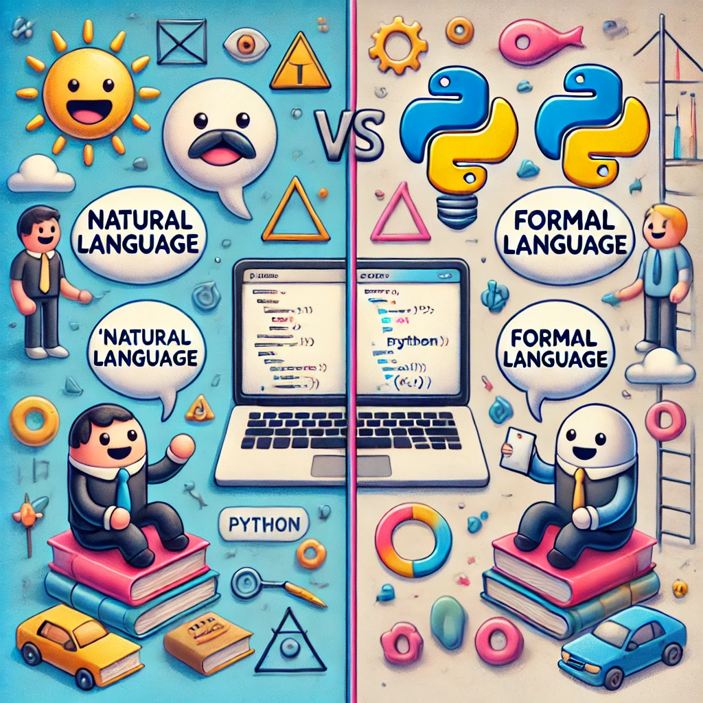

# 📖 Formal and Natural Languages: The Engineer’s Playbook 📚

Welcome to the linguistic battleground of programming! We’re about to explore two radically different worlds: the chaos of **natural languages** (like English) and the precision of **formal languages** (like Python). If you’ve ever wondered why your computer doesn’t understand your typos but your friends do, read on.

## Natural vs. Formal Languages

### Natural Languages: The Messy Real World

These are the languages humans speak—English, Spanish, Mandarin, Klingon (for some). They **evolved naturally**, and as much as we try to impose order, they thrive on **ambiguity**, **idioms**, and **redundancy**.

- **Example**: "The other shoe fell."
  - Meaning: Maybe something figurative. Maybe an actual shoe. Who knows? Depends on context.

### Formal Languages: The World of Precision

Designed by humans for specific purposes, formal languages are all about being exact and unambiguous. You’ve seen these in math, chemistry, and most importantly: **programming**.

- **Example**: `print("The other shoe fell.")`
  - Meaning: Literally display the text `"The other shoe fell."` on the screen. No ambiguity here.

## Key Differences Between Natural and Formal Languages

Let’s break it down:

| Feature         | Natural Languages                       | Formal Languages                           |
| --------------- | --------------------------------------- | ------------------------------------------ |
| **Ambiguity**   | Full of it. Context is king.            | None. A statement means one thing, always. |
| **Redundancy**  | Highly redundant (to reduce ambiguity). | Concise and to the point.                  |
| **Literalness** | Often metaphorical or idiomatic.        | Means exactly what it says.                |

### Cheeky Example:

- **Natural Language**: “Break a leg!”
  - Translation: Good luck (no legs will be harmed).
- **Formal Language**: `break_leg()`
  - Translation: Literally executes a function to _break a leg_ (you monster).

## An Engineer’s Toolkit: Understanding Syntax

### What is Syntax?

Syntax is the set of rules that governs how we arrange elements (tokens) in a formal language. Get it right, and your code runs like butter. Get it wrong, and...well, your program will yell at you (hello, syntax errors).

### Two Parts of Syntax:

1. **Tokens**:  
   These are the building blocks—words, numbers, symbols, etc.

   - **Python Example**: `print("Happy New Year for ", 2023)`
     - Tokens: `print`, `(`, `"Happy New Year for "`, `,`, `2023`, `)`.

2. **Structure**:  
   This is the order and arrangement of tokens. Tokens by themselves are not enough; they must follow the rules.
   - **Correct**: `print("Hello, Engineers!")`
   - **Incorrect**: `print)"Hello, Engineers!("`
     - Why? Parentheses are all wrong, and Python is not amused.

## Parsing: The Decoder Ring for Formal Languages

### What is Parsing?

Parsing is figuring out the structure of a sentence or statement, whether in natural language or code. In natural language, you do this subconsciously. In formal languages, your brain (or the computer) has to work a little harder.

### Example of Parsing in English:

- Sentence: “The other shoe fell.”
  - Subject: **The other shoe**.
  - Verb: **fell**.
  - Meaning: Probably something metaphorical...or not.

### Example of Parsing in Python:

- Code: `print("The other shoe fell.")`
  - Function: `print`.
  - Argument: `"The other shoe fell."`.
  - Meaning: Display the text exactly as it appears.

## Reading Programs: Tips for Engineers

Programming languages, like poetry, demand careful attention to detail. Unlike poetry, they have **zero tolerance for ambiguity** or errors. Here’s how to tackle formal languages like a pro:

1. **Take Your Time**  
   Formal languages are dense. Don’t expect to skim them like a novel or text from a friend.

2. **Parse First, Read Second**  
   Break the code into tokens and understand the structure before trying to interpret it.

3. **Focus on Details**  
   A missed comma or a mismatched parenthesis can be catastrophic. In programming, even small mistakes matter.

## Why This Matters for Engineers

Formal languages like Python are your ultimate engineering tools. They help you:

- Simulate complex systems with precision.
- Analyze data without ambiguity.
- Solve mathematical and physical problems systematically.

But they require discipline. If you’re sloppy, the computer won’t “guess” your intentions like a human would. Instead, it will refuse to cooperate until you fix your mistakes. (Think of it as a very picky coworker who’s always right.)

## Passing Words

Learning to program is like learning a new language—but better. It’s a language where every word, symbol, and punctuation mark has a clear, unambiguous purpose. Once you master this precision, you’ll be able to wield it across disciplines, from designing algorithms to simulating real-world systems.

So, buckle up. We’re about to leave the chaotic beauty of natural language behind and enter the world of structured elegance. Welcome to the world of programming! 🖥️
