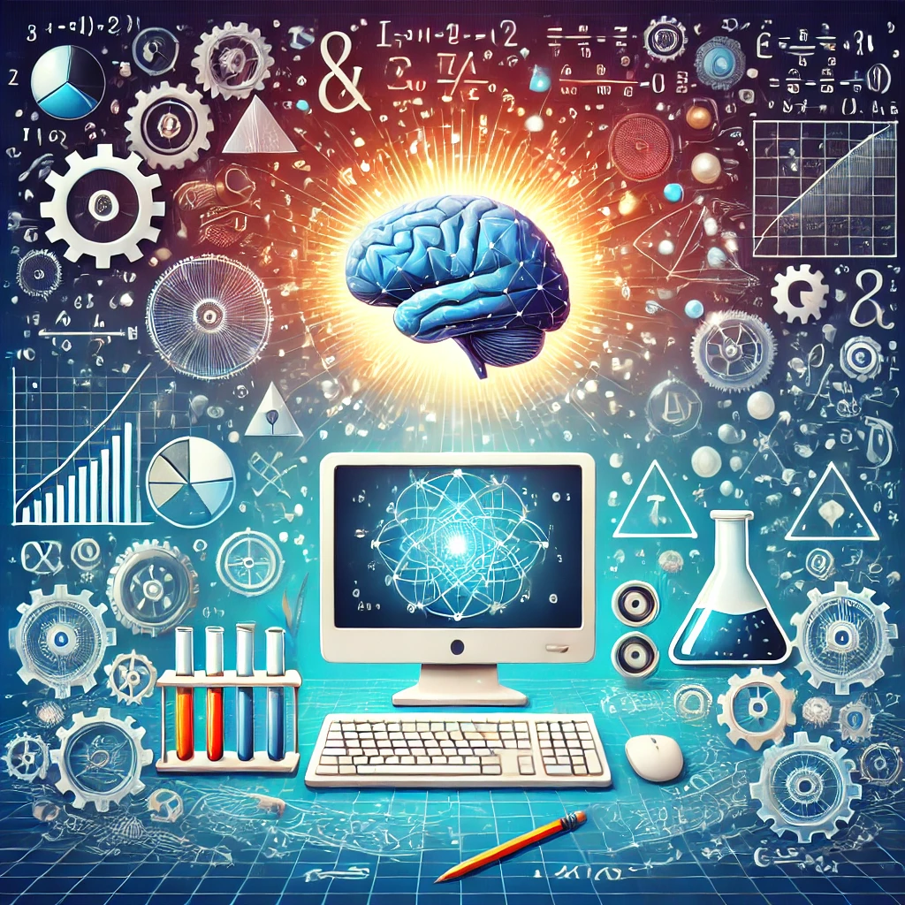

# 📖 The Programming Mindset 🧠

Welcome to the journey of learning to think like a computer scientist—a mindset that blends the precision of mathematics, the ingenuity of engineering, and the curiosity of natural science. Here's how these disciplines come together in the world of programming:

- **Mathematics**: Computer scientists use formal languages to articulate ideas and express computations, much like mathematicians use equations and symbols.
- **Engineering**: They design and build systems by combining components, weighing trade-offs, and optimizing solutions.
- **Science**: They observe how complex systems behave, form hypotheses, and test predictions through experiments.

At the heart of it all lies **problem-solving**—the quintessential skill for any computer scientist. Problem-solving isn’t just about writing code; it’s about:

1. **Defining the problem** clearly.
2. **Thinking creatively** about possible solutions.
3. **Expressing solutions** with clarity and precision.

Learning to program offers a unique platform to hone this skill. It’s not just about writing code; it’s about mastering the art of approaching challenges logically and systematically.

## What’s in it for You?

On one level, you'll acquire programming skills—an invaluable tool in today’s tech-driven world. But on a deeper level, programming will become a means to explore, innovate, and solve real-world problems.

As we progress, you'll see how this way of thinking applies not just to computers, but to the challenges we face in every aspect of life. Ready to embrace the way of the program? Let’s get started!
