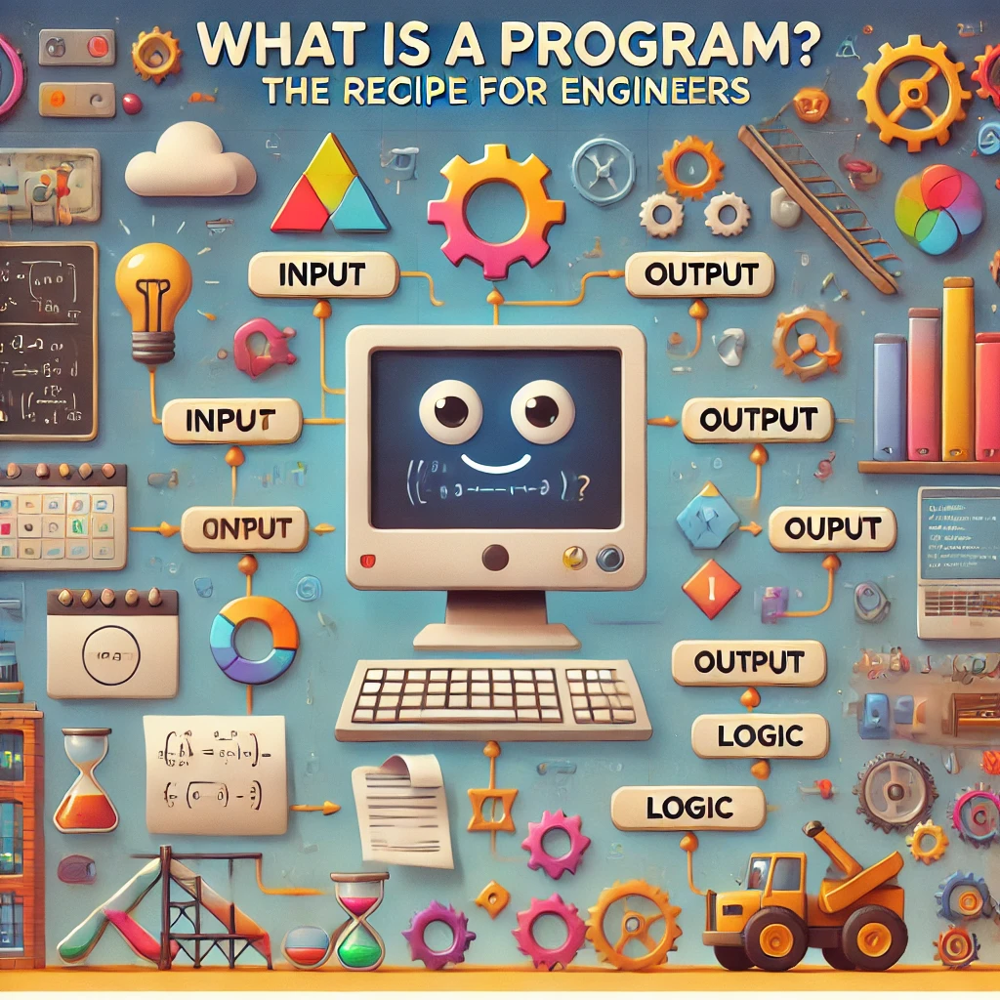

# 📖 What is a Program? 🤔

## The Engineer’s Guide to the Magic Behind the Code

So, you’re about to dive into the world of programming? Awesome! Before we start throwing code around like confetti at an engineering party, let’s take a moment to understand the **what** behind all this: **What is a program?**

### What is a Program?

Think of a program as a **recipe for your computer**. It's a precise set of instructions telling the computer exactly how to whip up something amazing, whether it’s solving equations, replacing all instances of “coffee” with “tea” in a document (blasphemy, I know), or even compiling another program (a very meta move).

At its core, a program is just **a sequence of instructions**. Whether you’re:

- Simulating a bridge under load,
- Analyzing heat transfer in a reactor, or
- Automating your homework submission system (shh, I won’t tell),

It’s all about breaking big tasks into tiny, manageable steps that your computer can handle.

### Your Toolbox: Basic Instructions

Here’s the thing: Computers aren’t geniuses (sorry, HAL 9000 fans). They just follow instructions really, really fast. But no matter how complex the program seems, it boils down to a handful of basic building blocks:

#### 1. Input: Asking the Computer for Stuff

This is how your program gets data to work with. Input could come from:

- **A keyboard** (e.g., when you enter your top-secret password).
- **A file** (like when analyzing heat maps from sensors).
- **A magical other device** (yes, even your smartwatch counts).

#### 2. Output: Sharing the Results

Once your program’s done its thing, it has to share the results. This could mean:

- Printing equations on the screen (yay, math).
- Saving data to a file (because engineers love spreadsheets).
- Sending a signal to turn on a motor (look at you, controlling robots).

#### 3. Math: Crunching Numbers Like a Boss

From simple addition to solving differential equations, math is the life force of most engineering programs. Need to calculate a load? Check. Optimize a design? Double-check.

#### 4. Conditional Execution: Decisions, Decisions

This is where your program gets to flex its “thinking” muscles:

- “If the load exceeds the limit, shut it down!”
- “If the temperature hits 100°C, alert the engineer (and run for cover).”

#### 5. Repetition: Loops, Baby!

Why do something once when you can automate it 1,000 times? Loops let you repeat actions with slight variations:

- Testing 1,000 beam designs to find the optimal one.
- Simulating flow over a wing with different airspeeds.

### Programming: The Art of the Breakdown

Here’s the secret sauce: **Every program you’ve ever used is just a bunch of these instructions, stitched together cleverly.**

Even the most complex simulations or control systems can be boiled down to:

1. A big problem (e.g., “Make this jet engine super-efficient”),
2. Broken into smaller problems (e.g., “Optimize airflow,” “Reduce drag”),
3. Broken into even smaller tasks (e.g., “Model turbulence,” “Adjust blade angles”),  
   ... until you’re left with tasks simple enough to describe using the basic instructions above.

This is the **essence of programming**: Take something that seems impossible, break it into bite-sized chunks, and let your computer handle the heavy lifting.

### How Does This Translate for Engineers?

- **Civil Engineers**: Simulate a bridge by modeling individual components (beams, bolts, forces).
- **Mechanical Engineers**: Automate repetitive tasks, like running thermal simulations at multiple power levels.
- **Biomedical Engineers**: Write programs to process MRI data and identify abnormalities.
- **Chemical Engineers**: Optimize reactor conditions by solving equations repeatedly with different parameters.

### Reality Check

At first glance, programming might feel like wrestling with a machine that only understands baby steps. But as engineers, isn’t that our jam? Whether you’re designing a skyscraper or writing Python scripts, it’s all about breaking big ideas into manageable pieces.

### The Bigger Picture

Sure, right now this might sound like learning to assemble IKEA furniture with half the instructions missing. But as we progress (and we will), this process will start to make sense, and we’ll introduce you to a new hero: the **algorithm**—your blueprint for solving problems step-by-step.
