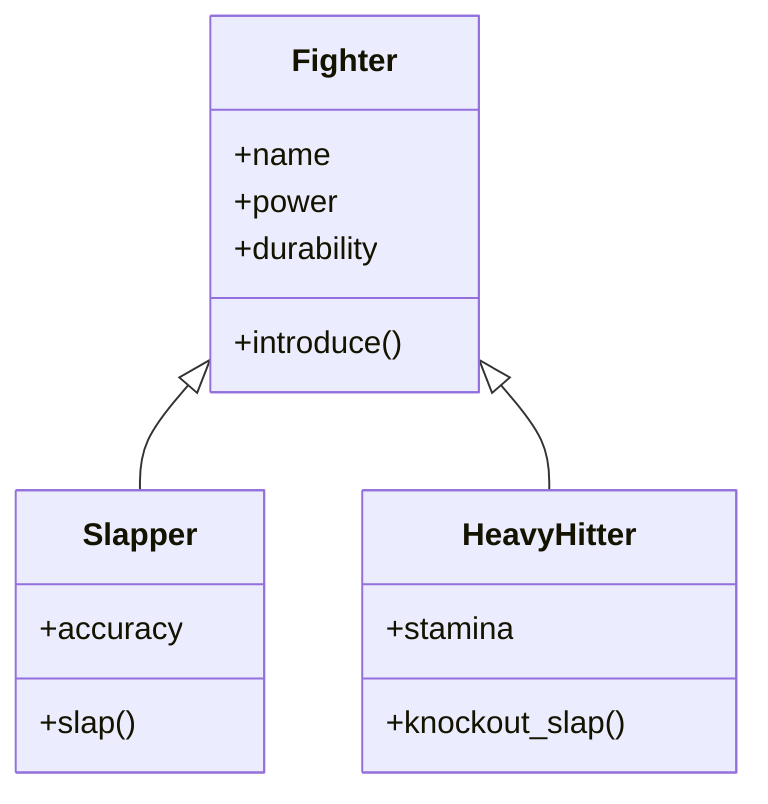

# 🥊 **Python Inheritance & Methods: PowerSlap Edition**

## 🚀 **Learning Objectives**

By the end of this section, you should be able to:

- Understand the basics of **inheritance** and why it's useful.
- Create and extend classes using `super()`.
- Differentiate between **instance methods** and **class methods**.

---

## 🏆 **What is Inheritance?**

Inheritance lets us create a **base class (parent)** and then extend it with **specialized versions (child classes)**. This allows for **code reuse** and makes programs more structured.

### **Example Context: PowerSlap Fighters 🥊**

Imagine a **base class** for all fighters and **specialized subclasses** for different styles:

- `Fighter` (base class)
- `Slapper` (child class)
- `HeavyHitter` (child class)



---

## 📊 **Common Uses for Inheritance: Graphing & Optimization**

### **Why Use Inheritance?**

Inheritance isn't just for organizing fighters—it's used in **real-world applications** like:

- **Graphing systems** (e.g., plotting different types of charts)
- **Optimization problems** (e.g., tuning different strategies for performance)

### **Example: Graphing System with Inheritance**

Let's say we want to create a **base class** for plotting graphs, then extend it for specific graph types.

```python
import matplotlib.pyplot as plt

class Graph:
    def __init__(self, title):
        self.title = title

    def show_title(self):
        return f"📈 Graph: {self.title}"

class LineGraph(Graph):
    def __init__(self, title, x_values, y_values):
        super().__init__(title)
        self.x_values = x_values
        self.y_values = y_values

    def plot(self):
        plt.plot(self.x_values, self.y_values)
        plt.title(self.title)
        plt.show()
```

### **How It Works:**

- **`Graph` (Base Class)**: Defines the **common structure** for graphs.
- **`LineGraph` (Child Class)**: Inherits from `Graph` and adds **specific behavior** (plotting data).

### **Using Our Graphing Classes**

```python
line_chart = LineGraph("Stock Prices", [1, 2, 3, 4], [100, 150, 200, 250])
print(line_chart.show_title())  # 📈 Graph: Stock Prices
line_chart.plot()  # Displays a line chart
```

---

## 🔥 **Creating a Base Fighter Class**

```python
class Fighter:
    def __init__(self, name, power, durability):
        self.name = name  # Instance attribute
        self.power = power  # Slap power level
        self.durability = durability  # How much damage they can take

    def introduce(self):
        """Introduce the fighter."""
        return f"👊 {self.name} enters the PowerSlap arena!"
```

### **Key Features:**

- `__init__()` initializes **fighter attributes**.
- `introduce()` lets the fighter **introduce themselves**.

---

## 💥 **Creating Specialized Fighters with Inheritance**

We can create **different types of fighters** by inheriting from `Fighter`.

```python
class Slapper(Fighter):
    def __init__(self, name, power, durability, accuracy):
        super().__init__(name, power, durability)  # Call parent constructor
        self.accuracy = accuracy  # Additional attribute

    def slap(self):
        return f"🖐️ {self.name} delivers a {self.power} power slap with {self.accuracy}% accuracy!"
```

```python
class HeavyHitter(Fighter):
    def __init__(self, name, power, durability, stamina):
        super().__init__(name, power, durability)
        self.stamina = stamina

    def knockout_slap(self):
        return f"💥 {self.name} goes for a brutal {self.power} power KO slap with {self.stamina}% stamina left!"
```

### **Key Features:**

- **Both `Slapper` and `HeavyHitter` inherit from `Fighter`**.
- `super().__init__()` calls the **parent constructor**.
- New classes **add their own unique attributes and methods** (`accuracy`, `stamina`).

---

## ⚡ **Using Our Classes in Action**

```python
slap_fighter = Slapper("John 'Quick Hand' Doe", 80, 60, 90)
heavy_fighter = HeavyHitter("Mike 'Iron Palm' Tyson", 100, 90, 70)

print(slap_fighter.introduce())  # 👊 John 'Quick Hand' Doe enters the PowerSlap arena!
print(slap_fighter.slap())  # 🖐️ John 'Quick Hand' Doe delivers an 80 power slap with 90% accuracy!

print(heavy_fighter.introduce())  # 👊 Mike 'Iron Palm' Tyson enters the PowerSlap arena!
print(heavy_fighter.knockout_slap())  # 💥 Mike 'Iron Palm' Tyson goes for a brutal 100 power KO slap with 70% stamina left!
```

---

## 📌 **Key Takeaways**

✅ **Inheritance** allows us to create a base class (`Fighter`) and specialized versions (`Slapper`, `HeavyHitter`).
✅ `super()` calls the parent constructor, keeping code DRY.
✅ **Child classes** can have **additional attributes & methods** beyond the parent class.
✅ **Inheritance is widely used in graphing, optimization, and structured modeling.**

🥊 **PowerSlap fighters inherit raw power—just like Python classes inherit code!**
