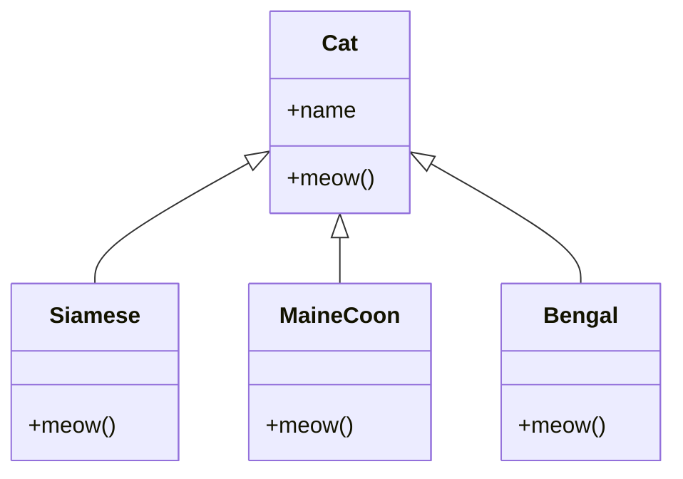

# 🐱 **Polymorphism in Python: Cat Breeds Edition**

## 🚀 **Learning Objectives**
By the end of this section, you should be able to:
- Understand the concept of **polymorphism** and why it’s useful.
- Use polymorphism to allow different classes to use the same method names.
- Implement **method overriding** to customize behavior in subclasses.

---

## 🏆 **What is Polymorphism?**
Polymorphism allows **different classes** to share the **same method names** but execute **different behaviors** depending on the object calling them. It helps in writing **more flexible and reusable code**.

### **Why is Polymorphism Useful?**
- **Consistency:** You can call the same method on different objects without worrying about their exact type.
- **Extensibility:** You can add new classes without modifying existing code.
- **Code Reusability:** Instead of writing different functions for each type, you use a common interface.

### **Example Context: Cat Breeds 🐱**
Imagine different cat breeds—**Siamese, Maine Coon, and Bengal**. They all **meow**, but each has a **different style of meowing**.



---

## 🐾 **Creating a Base Cat Class**
```python
class Cat:
    def __init__(self, name):
        self.name = name
    
    def meow(self):
        """Generic meow sound."""
        return f"{self.name} says: Meow!"
```
### **Key Features:**
- `__init__()` initializes the **cat’s name**.
- `meow()` is a **general method** that all cats can override.

---

## 😻 **Creating Specific Cat Breeds with Polymorphism**
Each cat breed **overrides** the `meow()` method with its own unique sound.

```python
class Siamese(Cat):
    def meow(self):
        return f"{self.name} says: Meeeeow! (in a fancy Siamese way)"
```

```python
class MaineCoon(Cat):
    def meow(self):
        return f"{self.name} says: MRRROOOOW! (deep Maine Coon roar)"
```

```python
class Bengal(Cat):
    def meow(self):
        return f"{self.name} says: Mew! Mew! (quick Bengal chirps)"
```

### **Key Features:**
- **Each cat breed overrides `meow()` differently.**
- The method **signature remains the same**, but the **output varies**.

---

## 🎭 **Using Polymorphism in Action**
```python
cats = [
    Siamese("Luna"),
    MaineCoon("Thor"),
    Bengal("Simba")
]

for cat in cats:
    print(cat.meow())
```
### **Output:**
```shell
Luna says: Meeeeow! (in a fancy Siamese way)
Thor says: MRRROOOOW! (deep Maine Coon roar)
Simba says: Mew! Mew! (quick Bengal chirps)
```

### **Why is this Useful?**
✅ **Same method name (`meow`) but different behaviors.**
✅ **Easier to work with different objects in loops/functions.**
✅ **New cat breeds can be added without changing existing code!**

---

## 🛠 **More Examples of Polymorphism**
### **Example 1: Using Polymorphism with a Function**
```python
def make_cats_meow(cat):
    print(cat.meow())

cat1 = Siamese("Luna")
cat2 = MaineCoon("Thor")
cat3 = Bengal("Simba")

make_cats_meow(cat1)  # Luna says: Meeeeow! (in a fancy Siamese way)
make_cats_meow(cat2)  # Thor says: MRRROOOOW! (deep Maine Coon roar)
make_cats_meow(cat3)  # Simba says: Mew! Mew! (quick Bengal chirps)
```
- A single function **`make_cats_meow()`** calls `meow()` on different cat types without needing `if` statements.

### **Example 2: Using Polymorphism with `len()`**
Python’s built-in `len()` function is an example of polymorphism!
```python
print(len("Paws"))  # Works on a string
print(len([1, 2, 3, 4]))  # Works on a list
print(len({"name": "Whiskers", "age": 3}))  # Works on a dictionary
```
- `len()` works on **multiple data types** because each object **implements `__len__()` differently.**

---

## 📌 **Key Takeaways**
✅ **Polymorphism allows multiple classes to share method names but have different behaviors.**
✅ **Method overriding** lets subclasses customize inherited methods.
✅ **Polymorphism makes code more reusable, modular, and scalable.**
✅ **Built-in functions like `len()` also use polymorphism.**

🐱 **Just like every cat has a unique personality, Python classes can override methods to exhibit their own behaviors!**
